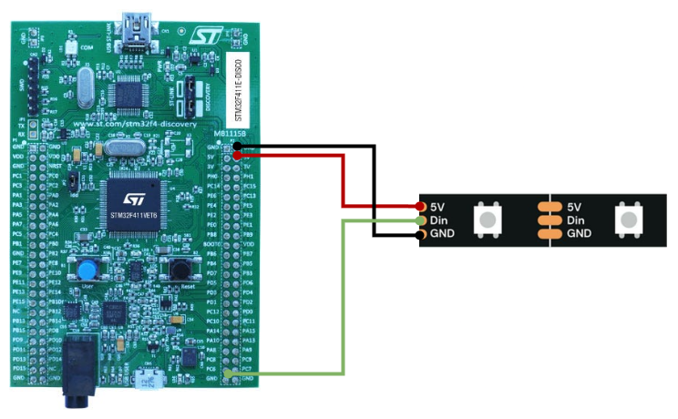

# Basic USART data TX 
In this specific example, the PWM and DMA interface the WS2818 addressable led.
PWM - Act as the communication protocol
DMA - For controlling the PWM duty cycle i.e. the data bits
WS2818 uses the signal high period for interpreting the data which resembles the duty cycle in PWM, so if we create an 800KHz PWM of which we set the duty cycle = 60% (0.75 µs), it will make LED interpret it as bit 1 and duty cycle = 30% (0.375 µs)will interpret as bit 0.
# Connection diagram

\

| STM 32  | WS2818 |
| ------- | ------ |
| 5V      | VCC    |
| GND     | GND    |
| PC6     | DIN    |

\
# [More about STM32 board](https://www.st.com/resource/en/user_manual/um1842-discovery-kit-with-stm32f411ve-mcu-stmicroelectronics.pdf)
\
# [More about WS2818 LED](https://www.tme.com/Document/1d930d9b83e8cce43e5d1c490ab0fbe8/WS2818A.pdf)

